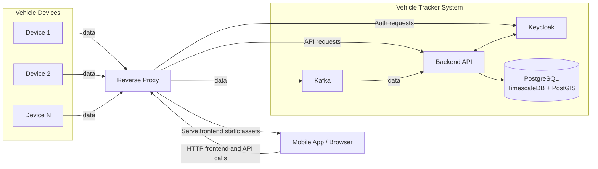

# VEHICLE TRACKER

Vehicle Tracker is a comprehensive application designed to monitor and manage vehicle locations in real-time.
It provides features such as live tracking, route history, geofencing, alerts for unauthorized movements and more.

## The Main Goal

The primary goal of this project is to practice and demonstrate solid software engineering practices,
including cloud-native development, real-time data processing, automated deployments with GitHub Actions,
and modern system architecture design.

## System Overview

The Vehicle Tracker system consists of a reverse proxy, multiple backend services, Kafka for messaging, a web application and a mobile application.

The backend services handle data ingestion, processing, storage, and provide APIs for the web and mobile app. Details about each service can be found in docs/architecture.

All requests from the web and mobile app pass through the reverse proxy, which routes them to the appropriate backend service.

Vehicle devices installed in vehicles send their data to the reverse proxy. This data is forwarded to Kafka and then processed by the backend services.

The following diagram illustrates the high-level architecture of the Vehicle Tracker system:

In folder `docs` you can find more detailed documentation about the architecture, deployment, and other aspects of the system.
## Stack

- **Backend**: Java with Spring Boot
- **Web Frontend**: Next.js with React and TypeScript
- **Mobile Frontend**: Kotlin with Jetpack Compose for Android
- **Database**: PostgreSQL with TimescaleDB and PostGIS extensions
- **Messaging**: Kafka
- **Containerization**: Docker (local and cloud deployment)

## Features
- Real-time vehicle tracking
- Route history visualization
- Geofencing setup and notifications
- Alerts for unauthorized movements

## Getting Started
See `docs/deployment.md` for instructions on setting up the system locally or on the cloud.