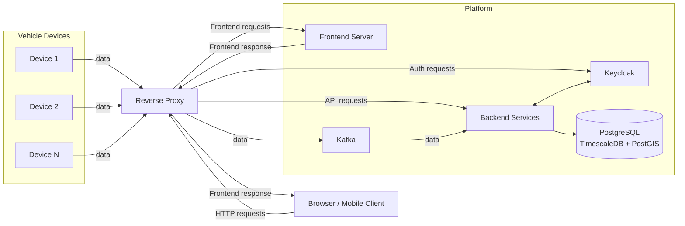

# VEHICLE TRACKER

Vehicle Tracker is a comprehensive application designed to monitor and manage vehicle locations in real-time.
It provides features such as live tracking, route history, geofencing, alerts for unauthorized movements and more.

## The Main Goal

The primary goal of this project is to practice and demonstrate solid software engineering practices,
including cloud-native development, real-time data processing, automated deployments with GitHub Actions,
and modern system architecture design.

## System Overview

The Vehicle Tracker system consists of a reverse proxy, multiple backend services, Kafka for messaging, a web application, and a mobile application.

The backend services are responsible for data ingestion, processing, and storage, and expose APIs consumed by both the web and mobile applications. More details about each service can be found in `docs/`.

All requests from the web and mobile applications pass through the reverse proxy, which acts as a single entry point and routes traffic to the appropriate backend service.

The web application is a Next.js web application built with React. It is served by a dedicated frontend server running behind the reverse proxy. When a user accesses the application through a browser, the request is first handled by the reverse proxy, which forwards it to the frontend server. The server responds with the web application, which is then loaded in the browser.

Once loaded, the web application communicates directly with the backend APIs via HTTP requests, which again go through the reverse proxy. The reverse proxy routes these API requests to the appropriate backend services. Authentication and authorization are handled via the identity provider (Keycloak), also accessed through the reverse proxy.

Vehicle devices installed in vehicles send their data to the reverse proxy. This data is forwarded to Kafka and then processed asynchronously by the backend services.

The following diagram illustrates the high-level architecture of the Vehicle Tracker system:

In folder `docs` you can find more detailed documentation about the architecture, deployment, and other aspects of the system.
## Stack

- **Backend**: Java with Spring Boot
- **Web Frontend**: Next.js with React and TypeScript
- **Mobile Frontend**: Kotlin with Jetpack Compose for Android
- **Database**: PostgreSQL with TimescaleDB and PostGIS extensions
- **Messaging**: Kafka
- **Containerization**: Docker (local and cloud deployment)

## Features
- Real-time vehicle tracking
- Route history visualization
- Geofencing setup and notifications
- Alerts for unauthorized movements

## Getting Started
See `docs/deployment.md` for instructions on setting up the system locally or on the cloud.