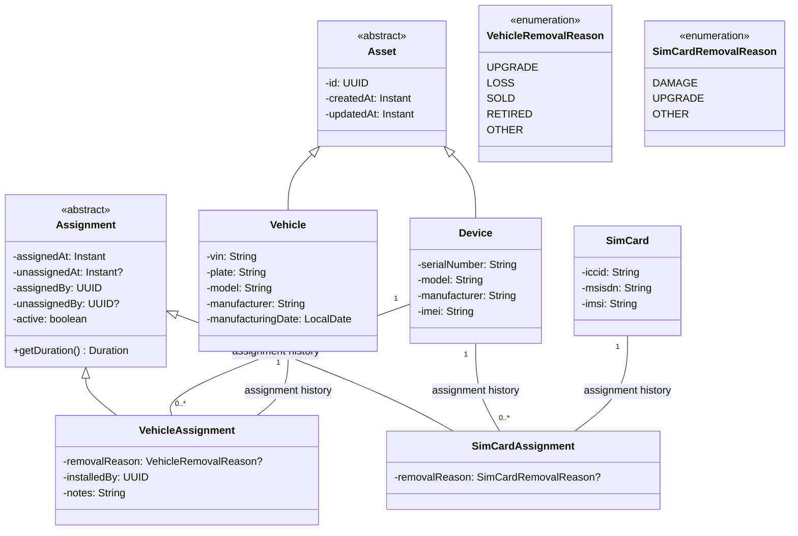

# Domain Model

The following diagram illustrates the domain model for the Asset Service, including the shared asset abstraction and the association lifecycle between devices and vehicles.

### Asset

`Asset` is the abstract root entity for everything managed by the Asset Service. It captures the common identity and lifecycle metadata shared by both devices and vehicles.

This abstraction keeps the model consistent with the service responsibility described in the overview: both devices and vehicles are assets, even though they have different attributes and behaviors.

### Device

`Device` represents the physical tracker or gateway that can be provisioned independently of a vehicle. Its main domain-specific attribute is the `serialNumber`, while the inherited asset identity allows it to be managed uniformly by the service.

The overview explicitly states that a device may exist without a vehicle. For that reason, the relationship from `Device` to `VehicleAssignment` is optional over time: a device can have zero assignments, one active assignment, and many historical assignments.

The `Device` can also have an optional association with a `SimCard` through the `SimCardAssignment`, which allows for tracking the SIM card used by the device over time. This is important for knowing which SIM card is currently active in the device, and if the device loses connectivity, the service can check the SIM card history to troubleshoot.

### Vehicle

`Vehicle` represents the physical entity that can be tracked by a device. It has its own unique attributes such as `vin`, `plate`, and `manufacturingDate`. The overview describes that a vehicle should be associated with a device, but the device can exist without a vehicle. This is reflected in the model by allowing a `Vehicle` to have zero or more `VehicleAssignment`s, which means it can be associated with a device at some point in time, but it is not mandatory.

### Assignment

The `Assignment` class captures the lifecycle of an association between a device and a vehicle, or between a device and a SIM card. It includes timestamps for when the assignment was made and when it was removed, as well as the user responsible for each action. The `isActive()` method allows checking if the assignment is currently active, while `getDuration()` can be used to calculate how long the assignment has been in place.

### VehicleAssignment and SimCardAssignment

`VehicleAssignment` and `SimCardAssignment` are concrete subclasses of `Assignment` that represent specific types of associations. They include additional attributes relevant to their context, such as `removalReason` for tracking why an assignment was removed, and `installedBy` for recording who installed the device on the vehicle.

The `VehicleRemovalReason` and `SimCardRemovalReason` enumerations provide predefined reasons for why an assignment might be removed, which can help with reporting and analytics on asset usage and lifecycle events.
