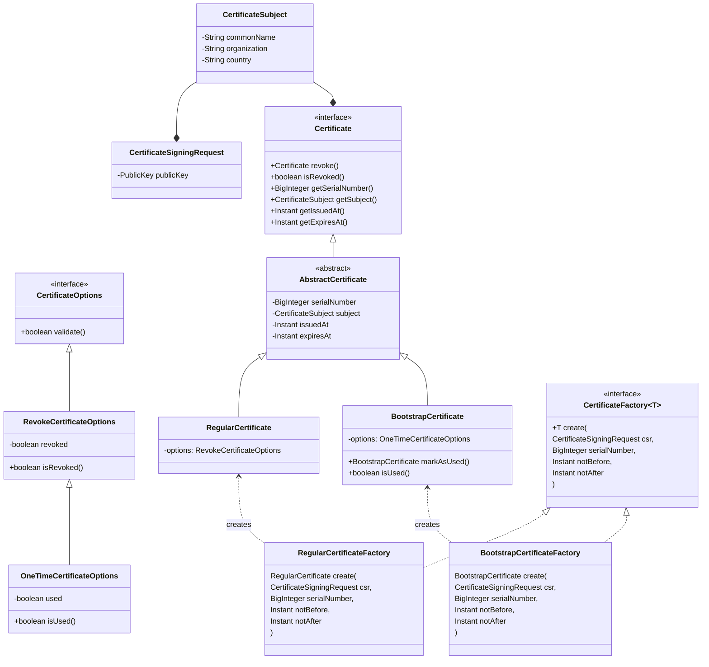

# Identity Service

The Identity Service is responsible for managing certificates for devices and the other services within the system. It provides a secure way to issue certificates for devices.

## Domain Model

The following diagram illustrates the domain model for the Identity Service, which we will discuss in more detail in the subsequent sections.

### CertificateSubject

The `CertificateSubject` class represents the subject of a certificate, containing information such as the common name, organization, and country. It is a simple value object that is used to show the identity of the certificate holder.

### CertificateSigningRequest
The `CertificateSigningRequest` class represents a request to sign a certificate. It contains the public key that will be included in the certificate issued by this service.
When arrives a new request to issue a certificate, the Identity Service should extract the public key, the subject information and other relevant information from the raw data given in the request. Then, it should create a `CertificateSigningRequest` object and pass it to the appropriate factory to create the certificate.

### CertificateOptions
The `CertificateOptions` interface defines the common options for certificates. It includes a method to validate the options, ensuring that they meet the necessary criteria for revocation or one-time use.

There are two specific implementations of `CertificateOptions`:
- `RevokeCertificateOptions`: This class includes a boolean field `revoked` to indicate whether the certificate has been revoked. It provides methods to check if the certificate is revoked and to set the revoked status.
- `OneTimeCertificateOptions`: This class includes a boolean field `used` to indicate whether the certificate has been used. It provides methods to check if the certificate is used and to set the used status.

### Certificate
The `Certificate` interface defines the common behavior for all certificates. It includes methods to revoke the certificate, check if it is revoked, get the serial number, get the subject, and get the issued and expiration dates.

### AbstractCertificate
The `AbstractCertificate` class is an abstract implementation of the `Certificate` interface. It contains common fields such as `serialNumber`, `subject`, `issuedAt`, and `expiresAt`. It serves as a base class for specific types of certificates.

### RegularCertificate
The `RegularCertificate` class extends `AbstractCertificate` and represents a regular certificate that can be revoked. It includes an instance of `RevokeCertificateOptions` to manage the revocation status of the certificate.

This type of certificate is typically used for devices or service that require long-term authentication. It can be revoked if the device is compromised or no longer needs access.

### BootstrapCertificate
The `BootstrapCertificate` class extends `AbstractCertificate` and represents a bootstrap certificate that can be used only once. It includes an instance of `OneTimeCertificateOptions` to manage the usage status of the certificate.

This type of certificate is typically used for initial device provisioning, allowing a device to authenticate and receive a regular certificate. Once the bootstrap certificate is used, it cannot be used again.

### CertificateFactory
The `CertificateFactory` interface defines a generic factory for creating certificates. It includes a method to create a certificate based on a `CertificateSigningRequest`, a serial number, and validity dates.

### BootstrapCertificateFactory
The `BootstrapCertificateFactory` class implements the `CertificateFactory` interface to create `BootstrapCertificate` instances. It provides the logic to create a bootstrap certificate based on the provided information.

### RegularCertificateFactory
The `RegularCertificateFactory` class implements the `CertificateFactory` interface to create `RegularCertificate` instances. It provides the logic to create a regular certificate based on the provided information.
