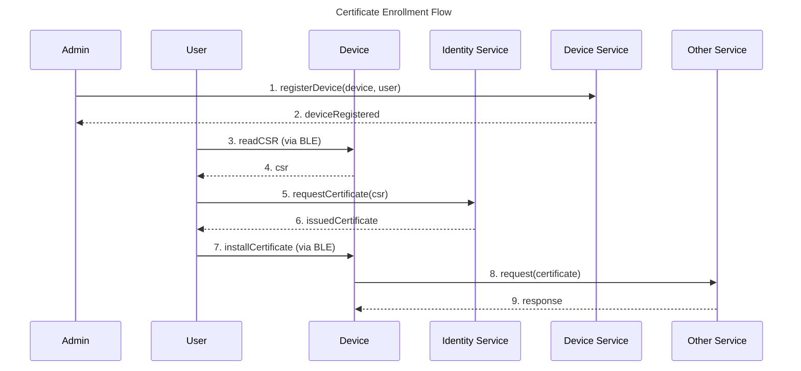
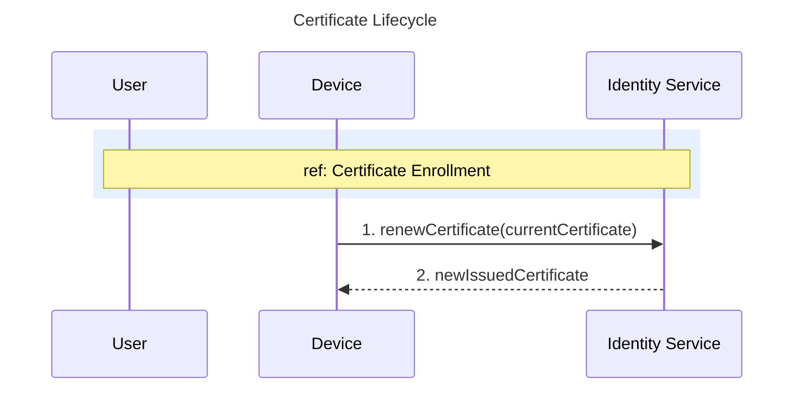

# Certificate Lifecycle

The system uses a single type of certificate — the **Certificate** — issued by the Identity Service. This certificate is used for authenticating the device with the MQTT broker and other services.

## Certificate Enrollment

Before a device can authenticate with the system, it must obtain a Certificate. The enrollment process is user-driven and takes place via BLE.

The enrollment flow can be summarized in the following steps:

1. The administrator registers the device in the system and assigns it to a user.
2. The user connects to the device via BLE and reads the CSR generated by the device.
3. The user submits the CSR to the Identity Service. The Identity Service trusts the request because the device is assigned to the user.
4. The Identity Service signs the CSR and issues a Certificate.
5. The user installs the Certificate on the device via BLE.
6. The device uses the Certificate to authenticate with other services, such as the MQTT broker.

The following diagram illustrates the certificate enrollment flow:

## Certificate Usage

The **Certificate** is a long-term certificate used for authenticating the device with other services, such as the MQTT broker. It has a validity period of several months, after which it must be renewed.

The lifecycle of the Certificate can be summarized in the following steps:

1. The user installs the Certificate on the device via BLE (see enrollment above).
2. The device uses the Certificate to authenticate with other services.
3. Before the Certificate expires, the device renews it directly with the Identity Service.

The following diagram illustrates the Certificate usage:

## Certificate Renewal

The Certificate has a long but finite validity period. The device must renew the certificate before it expires to ensure uninterrupted authentication with the other services. The renewal process involves the following steps:

1. The device detects that the Certificate is about to expire.
2. The device uses the current Certificate to request a new Certificate from the Identity Service.
3. The Identity Service issues a new Certificate to the device.
4. The device starts using the new Certificate for authentication and the old Certificate is no longer valid.

If the device fails to renew the Certificate before it expires (for example, due to network issues or a power failure), it will be unable to authenticate with other services until a new certificate is installed. In this case, the user must re-enroll the device via BLE following the [enrollment process](#certificate-enrollment) described above.

## Certificate Revocation

Certificate revocation invalidates a Certificate before its natural expiry. This can happen in two scenarios:

1. **The user requests a new CSR**: When the user reads a new CSR from the device via BLE, the device generates a new key pair. The Identity Service automatically revokes the previous certificate associated with that device when the new certificate is issued.
2. **The certificate expires**: An expired certificate is automatically considered invalid.

When a Certificate is revoked, the device can no longer authenticate with other services. To restore access, the user must re-enroll the device via BLE by reading the new CSR and installing the new certificate, as described in the [enrollment process](#certificate-enrollment).

It is important to note that certificate revocation due to compromise is not a common scenario. In practice, it typically happens when the user explicitly requests a new CSR or when the certificate reaches its expiration date.
