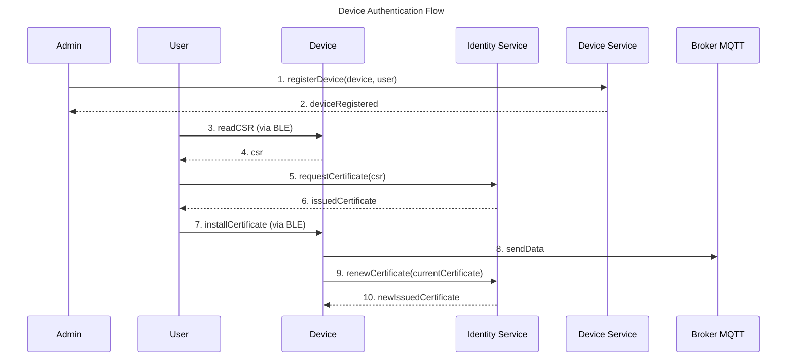

# Device Authentication Overview

Devices are an important part of the vehicle tracking system. They are responsible for sending the location data to the server, which is then used to track the vehicle. To ensure that only authorized devices can send data to the server, we need to implement device authentication.

The devices send their data to the MQTT broker, which is responsible for authenticating the devices before allowing them to publish their data. This is possible by verifying if the certificate provided by the device is valid and has been issued by a trusted certificate authority (CA). The CA is responsible for issuing certificates to the devices, which can be used for authentication.

The system designed for device authentication is called the **Identity Service**. The Identity Service is responsible for issuing and managing the certificates for the devices. We will talk more about the Identity Service in the [Identity Service](./identity-service.md) section.

The device authentication process can be summarized in the following steps:

1. The administrator registers the device in the system and assigns it to a user.
2. The user connects to the device via BLE and reads the CSR (Certificate Signing Request) generated by the device.
3. The user submits the CSR to the Identity Service. The Identity Service trusts the request because the device is assigned to the user.
4. The Identity Service signs the CSR and issues a Certificate to the user.
5. The user installs the Certificate on the device via BLE.
6. The device uses the Certificate to authenticate with the MQTT broker and publish its data.
7. The device renews the Certificate directly with the Identity Service before it expires.

The following diagram illustrates the device authentication process:

There are some important points to note about the device authentication process:

- The CSR is generated by the device and contains the device's public key. The corresponding private key never leaves the device, ensuring that the certificate is bound to the specific device hardware.
- The Identity Service trusts the CSR submission because the device is already registered and assigned to the requesting user in the system. No Bootstrap Certificate is required.
- What if the private key of the device is compromised? The user can request a new CSR from the device via BLE. When this happens, the device generates a new key pair and the Identity Service automatically revokes the previous certificate associated with that device. More details are covered in the [Certificate Lifecycle](./certificate-lifecycle.md) section.
- The Identity Service also supports certificate renewal. Before a certificate expires, the device can request a new one directly from the Identity Service, ensuring uninterrupted authentication with the MQTT broker.

Summarizing, device authentication is a crucial aspect of the vehicle tracking system to ensure that only authorized devices can send data to the server. The Identity Service plays a key role in managing the certificates for the devices and ensuring secure authentication with the MQTT broker. You can find more details about the Identity Service in the [Identity Service](./identity-service.md) section.
