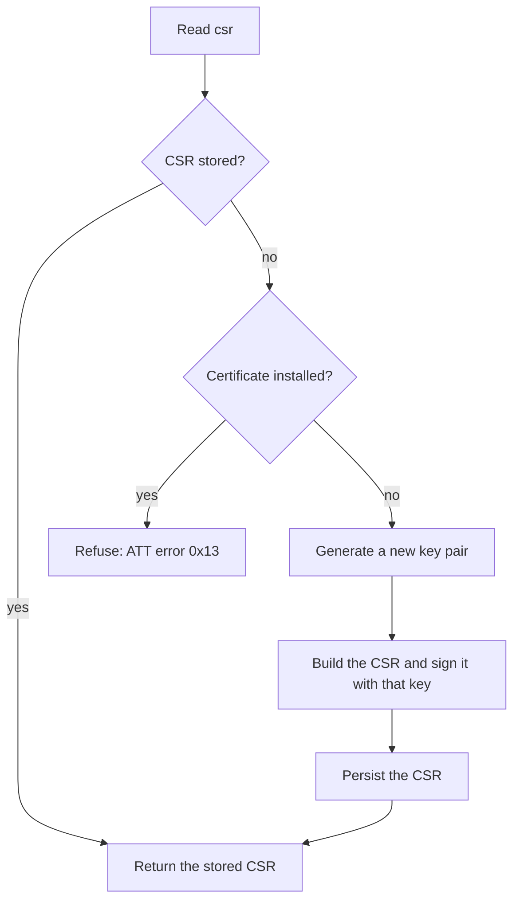

# Authentication Service

This document provides the parameters and configuration details for the Authentication Service, which is responsible for managing the device's authentication credentials used to connect to the MQTT broker.

## Structure

**Service UUID**: `347df573-cf50-f1b5-e749-1efe2d71272e`

| Name | UUID | Type | Actions | Description | Default Value |
|---|---|---|---|---|---|
| csr | 90785634-12ef-cd2b-9008-f6e5d4c3b2a1 | file | read | The Certificate Signing Request (CSR) generated by the device. | - |
| certificate | df5c268d-107b-d836-e808-a442ac515561 | file | read, write | The certificate generated from the CSR | - |
| ca | 39897685-53c9-7092-d542-7dbfc95f7dce | string | read, write | The CA certificate trusted by the device. | - |
| revoke | 6e5b0cbc-87f6-9c9a-4d43-e29bb72441aa | boolean | write | A flag to revoke the current certificate. | - |
| expiration | 7c85ca03-73b1-d990-6d4f-8267197e2e0e | string | read, write | The expiration time that will be used to generate the certificate (in seconds) | `31536000` (1 year) |
| status | aeb2f94c-b465-568d-264f-8a4ca22abc62 | string | read | The status of the certificate (`valid`, `expired`, `pending`, `revoked`) | - |

## CSR generation

The device does not generate a request on every read. Reading `csr` returns the stored request when there is one, and only builds a new one when the device holds none — on first boot, or after the credentials have been revoked. If no request is stored but a certificate is already installed, the read is refused instead of generating one, since that would rotate the key out from under the installed certificate:

A refused read fails with ATT error `0x13` (`Value Not Allowed`). To generate a new CSR from that state, the client must first write `1` to `revoke`.

Generating a request creates a **new** NIST P-256 key pair in the device's key store, replacing whatever was there, and the request is signed with it. The common name is the device identifier, the same one the device shows as a QR code for registration. The private key is created without export permission and never leaves the key store, so only the request itself is ever read over BLE. Generation takes a few seconds on first read; later reads are served from storage.

Keeping the request is what makes the read coherent: a PEM-encoded P-256 CSR is around 480 bytes, which is larger than a single ATT packet, so the client reads it in several chunks and every chunk must come from the same request. It also means an enrolled device keeps answering with the request its certificate was issued for — re-reading `csr` does not re-key a working device.

## Installing and revoking

Writing `certificate` stores the issued certificate and leaves the stored CSR untouched, so the request the certificate was issued for is preserved for as long as that certificate is valid. `csr` stays readable afterwards — it keeps returning that same stored request, per the "CSR stored?" branch above — but a request that would have to be freshly generated is refused while a certificate is installed, which can only happen if the CSR entry is missing without the certificate having been removed first (see below).

Writing `1` to `revoke` deletes the installed certificate, then the stored CSR, then the private key they were bound to, which is what makes the issued certificate unusable: the device can no longer prove it holds the matching key. Deleting the certificate first means an interruption partway through never leaves the refusal above as a dead end: at worst, the device is left with no certificate and a stale CSR still on file, which is read back unchanged rather than regenerated. Completing the revocation in that case requires writing `1` to `revoke` again — a later `csr` read on its own does not finish the job. Writing `0` does nothing, and the flag itself is not stored — it is a command rather than a configuration value.
