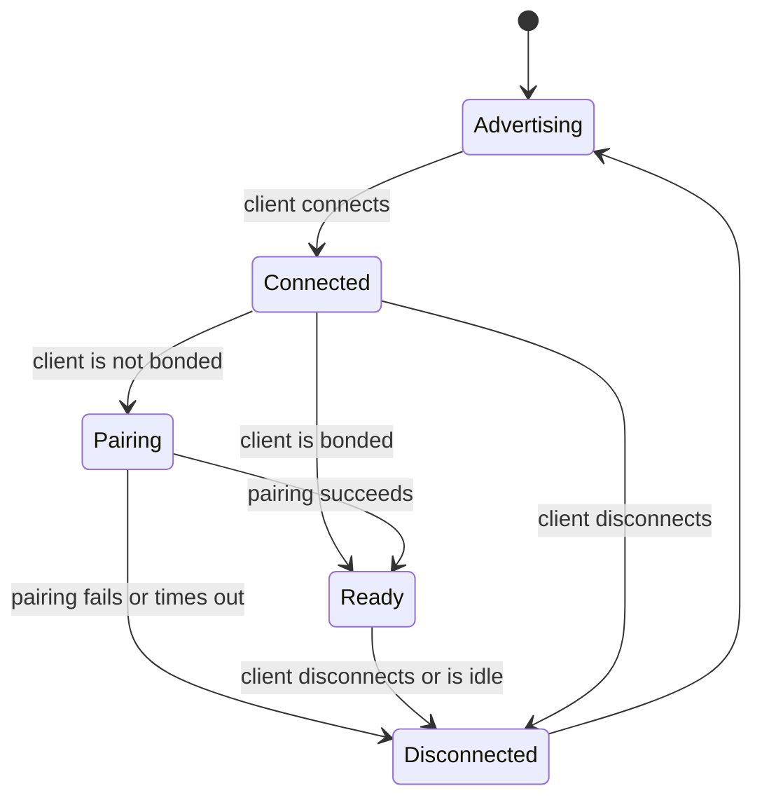

# BLE Lifecycle

This document describes the lifecycle of a BLE connection between the mobile application and the device: the states a connection goes through, what is allowed in each, and what happens when it ends. For the layer's role in the firmware, refer to the [BLE Overview](overview.md#architecture).

The lifecycle covers the BLE connection only. When the device is available for BLE, and how it reacts to its own state, is decided by the device lifecycle, not by the BLE layer.

## States

| State | Description |
|---|---|
| **Advertising** | The device is discoverable, advertising its identifier, and waiting for a client. |
| **Connected** | A client has connected, but it is not yet allowed to access the GATT server. |
| **Pairing** | The client and the device pair and bond, using the passkey. |
| **Ready** | The client is authenticated and can read and write characteristics. |
| **Disconnected** | The connection has ended and its state is discarded. |

### Advertising

The device advertises its own identifier, the same one it shows as a QR code for registration, so that the mobile application can tell which device it found. Advertising is only a way to be found: it gives no access to configuration.

### Connected

The device accepts the connection but rejects every request until the client is authenticated. Only one client can be connected at a time, so the device stops advertising and cannot be found by other clients until the connection ends. A client that was bonded in a previous connection is already trusted, so it goes straight to **Ready**. Any other client must pair first.

### Pairing

The client proves it knows the passkey through the native pairing and bonding mechanism. When pairing succeeds, the device stores the bond so that the client does not need to pair again. When it fails, or when it is not completed within the [timeout](#timeouts), the device closes the connection.

### Ready

The client discovers the services, negotiates the MTU and reads and writes characteristics, as described in the [service documents](config/). Requests are independent of each other, except for [file characteristics](characteristics/file-characteristic.md), whose chunked transfers belong to the connection they started on.

### Disconnected

Whether the client disconnects or the connection is lost, the device discards everything tied to that connection:

- File transfers in progress. A read restarts from `offset` 0 on the next connection, and a write that did not receive its last chunk is dropped without changing the stored value.
- Negotiated parameters, such as the MTU, which are agreed again on the next connection.

Values already written, and the bond, are kept. The device then returns to **Advertising**, subject to the device lifecycle.

### Timeouts

A client that stays connected without finishing pairing, or that sends no request while **Ready**, is disconnected after 1 minute. This keeps a client that is gone or stalled from holding the only connection.

## Guarantees

- A client never reaches a characteristic before it is authenticated.
- A connection that ends mid-operation leaves the stored configuration unchanged, because a value is only persisted once complete and valid.
- A new connection always starts from a clean state, regardless of how the previous one ended.
