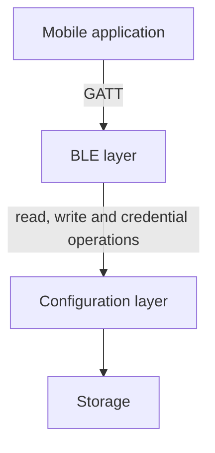

# BLE Overview

This document provides a high-level overview of the BLE (Bluetooth Low Energy) communication used in the vehicle-tracker system. BLE is used to configure devices through a mobile application.

> **Note**: This system is still under development. More services may be added in the future.

## Architecture

### Purpose

The BLE layer is the interface between the mobile application and the device. Its only job is to carry values between the two: it exposes the device's configuration and credential operations to an authorized client, and nothing more. Because it makes no decisions about what a value means, it can be replaced or extended without touching the rest of the device.

### Responsibilities

| The BLE layer owns | The BLE layer does not own |
|---|---|
| The GATT server and the services and characteristics it exposes. | What each setting means, its key, its validation rules and its default. Those belong to the [configuration layer](../config/overview.md). |
| Pairing and bonding with the client, through the native BLE mechanism. | Credential rules, such as when a CSR is generated, refused or deleted, and how credentials are revoked. Those belong to the configuration layer too. |
| Transporting values: chunking of [file characteristics](characteristics/file-characteristic.md) and respecting the negotiated MTU. | Persisting values. Storage is reached only through the configuration layer. |
| Translating the outcome of a request into an error code the client understands. | Deciding whether a value is valid. |

A good test of the boundary is that a rule can be changed, such as a new range for the GPS update frequency, without editing any BLE code.

### Boundaries

Dependencies point in one direction: the BLE layer depends on the configuration layer, and it never depends on the BLE layer. No other part of the firmware may depend on the BLE layer.

#### Relation to the configuration layer

The BLE layer treats the configuration layer as the single source of truth for settings and credentials. For each request it passes the value on and receives one of three outcomes: the value, an indication that the setting is not configured, or a rejection with a reason. The BLE layer reports that outcome to the client and never works around it, for example by applying its own default or by accepting a value the configuration layer refused.

#### Access control

Access control stays in the BLE layer. It enforces **who may talk to the device**, through pairing and bonding, and an unauthenticated client is rejected before any request reaches the configuration layer.

Credential operations, such as reading the CSR or revoking the credentials, are part of the configuration. The configuration layer decides what they do: when a CSR is generated, when a read is refused, and what revoking removes. The BLE layer exposes them as characteristics and relays the result. The [Authentication Configuration](../config/authentication.md) describes their behavior.

### Stability towards the mobile application

The mobile application is released separately from the firmware, so devices in the field must keep working with the app versions in use. The BLE layer is the contract between the two.

**Stable**, and not changed once released:

- Service and characteristic UUIDs.
- The type, encoding and allowed actions of each characteristic.
- The framing of file characteristics.
- The error codes and their meaning.

**Free to change**, because they sit behind the contract:

- How values are validated and stored.
- Default values, as long as the characteristic stays readable.
- How credential operations are implemented.

Changes to the contract are additive: new services and characteristics are added, and existing UUIDs and error codes are never reused with a different meaning. A change that cannot be made additively needs a new service next to the old one, so that both app versions keep working.

## Authentication

Authentication is handled at the BLE protocol level through the native pairing and bonding mechanism, using a PIN (Passkey). The device will reject any configuration request from unauthenticated clients.

## GATT Server

The device exposes a **GATT Server** that allows authorized clients to read and write configuration parameters. The GATT Server is organized into services, each grouping related characteristics.

## Services

| Service | Description | Document |
|---|---|---|
| **Connection Service** | Allows reading and writing device connection parameters. | [Connection Service](config/connection.md) |
| **GPS Service** | Allows reading and writing GPS configuration parameters. | [GPS Service](config/gps.md) |
| **Authentication Service** | Allows reading and writing authentication parameters. | [Authentication Service](config/authentication.md) |

## Characteristics

Each service groups characteristics, and each characteristic holds one value. For what a characteristic is and the types it can have, refer to the [Characteristics Overview](characteristics/overview.md).

## Configuration

Each service exposes one section of the device's configuration. The BLE documents list each value's UUID, type and allowed actions. The [Configuration](../config/overview.md) documents describe what each value means, its default, and how the device handles it.

## Lifecycle

For the states a BLE connection goes through, from advertising to disconnection, refer to the [BLE Lifecycle](lifecycle.md).

## Error Handling

The device answers failed requests with error codes, which are the same for every service. For the codes and their meaning, refer to [Error Handling](error-handling.md).
