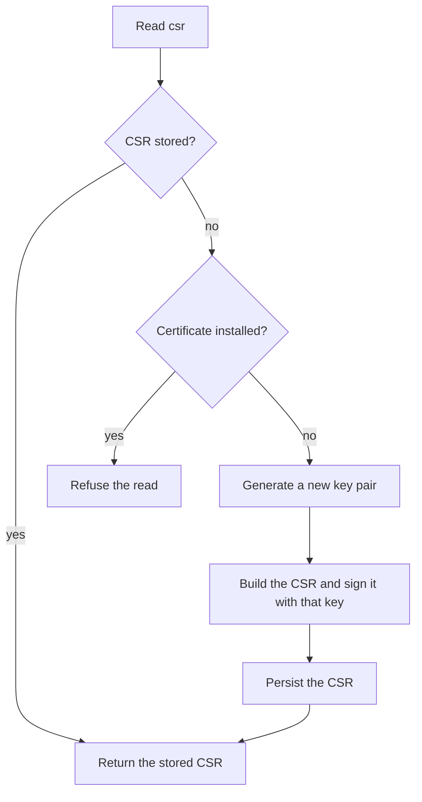

# Authentication Configuration

This document describes the authentication configuration, which holds the credentials the device uses to connect to the MQTT broker. For how these credentials are issued and renewed, refer to the [Certificate Lifecycle](../security/authentication/certificate-lifecycle.md).

## Settings

| Name | Type | Description | Default Value |
|---|---|---|---|
| certificate | PEM | The certificate issued from the CSR. | - |
| ca | PEM | The CA certificate trusted by the device. | - |
| expiration | string | The expiration time, in seconds, used when generating the certificate. | `31536000` (1 year) |

## Device-managed values

The device produces these values itself. Clients can read them but not write them.

| Name | Type | Description |
|---|---|---|
| csr | PEM | The Certificate Signing Request (CSR) generated by the device. |
| status | string | The status of the certificate (`valid`, `expired`, `pending`, `revoked`). |

## Commands

| Name | Type | Description |
|---|---|---|
| revoke | boolean | Writing `1` revokes the current credentials, and writing `0` does nothing. The flag is a command, so the device does not store it. |

The [Authentication Service](../ble/config/authentication.md) exposes these values over BLE.

## CSR generation

The device does not generate a request on every read. Reading `csr` returns the stored request when there is one, and the device only builds a new one when it holds none, which happens on first boot or after the credentials have been revoked. Once a certificate is installed, the device deletes the request (see [Installing and revoking](#installing-and-revoking)) and refuses any further read, because generating a new request would replace the key the installed certificate depends on:

To get a new CSR while a certificate is installed, the client must first revoke the current credentials.

Generating a request creates a new NIST P-256 key pair in the device's key store, replacing whatever was there, and signs the request with it. The common name is the device identifier, the same one the device shows as a QR code for registration. The private key is created without export permission and never leaves the key store, so only the request itself can be read. Generation takes a few seconds on the first read, and later reads are served from storage.

The device stores the request so that every read returns the same one. A PEM-encoded P-256 CSR is around 480 bytes, larger than a single BLE packet, so the client reads it in several chunks, and all of them must come from the same request. The request is only needed until the certificate is installed, so the device keeps it until then.

## Installing and revoking

Writing `certificate` stores the issued certificate and then deletes the stored CSR, which the device no longer needs. The certificate is stored first, so an interruption between the two steps leaves the device with both, and reading `csr` returns the request the certificate was issued for. Once the CSR is deleted, reading `csr` is refused until the credentials are revoked.

Revoking deletes the installed certificate, then the stored CSR if there is one, then the private key they were bound to. Without that key the device can no longer prove it owns the certificate, so the certificate becomes unusable. The certificate is deleted first so that an interruption partway through cannot leave the device stuck on the refusal above. If the device is interrupted after deleting the certificate, the next `csr` read either generates a new key pair, when no CSR is stored, or returns the stale CSR still on file. In the second case, revoke again to finish the revocation; reading `csr` on its own does not complete it. This only revokes on the device. The client must also revoke the certificate on the Identity Service, as described in the [Certificate Lifecycle](../security/authentication/certificate-lifecycle.md#certificate-revocation).
