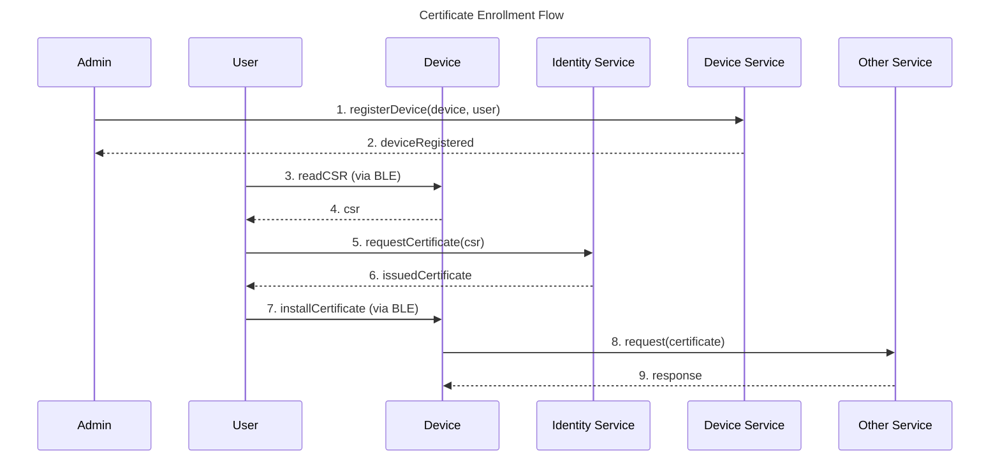
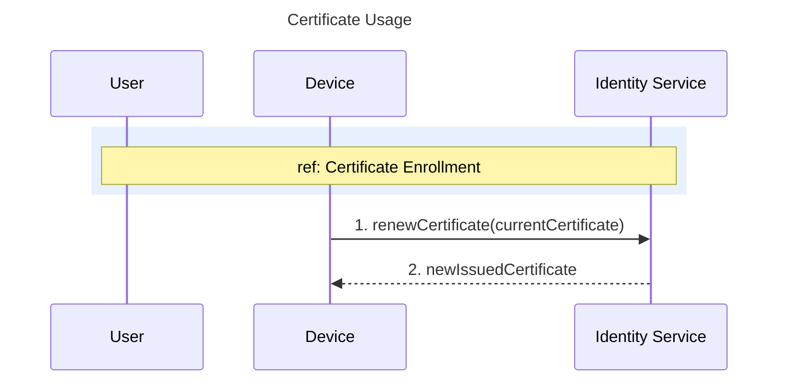

# Certificate Lifecycle

The system uses a single certificate issued by the Identity Service. This certificate is used for authenticating the device with the MQTT broker and other services.

## Device Key and CSR

The device creates its own key pair. The private key proves that the device owns its certificate, so it is the part that must never leave the device.

- **Creating a request** generates a new NIST P-256 key pair in the device's key store, replacing any key that is there, and signs the request with it. The common name is the device identifier (see [Security](../overview.md#identity)).
- **The private key** is created without export permission and never leaves the key store. Only the request can be read.
- **The request is stored**, so every read returns the same one. A PEM-encoded P-256 CSR is around 480 bytes, larger than a single BLE packet, so the client reads it in several chunks, and all of them must come from the same request.
- **The request is kept** only until a certificate is installed. Once a certificate is installed, reading the request is refused until the credentials are revoked, because a new request would replace the key the certificate depends on.

### Installing a certificate

The device stores the certificate first and then deletes the stored request. An interruption between the two steps leaves both in storage, and reading the request returns the one the certificate was issued for.

### Revoking on the device

The device deletes the installed certificate first, then the stored request if there is one, then the private key they were bound to. The certificate goes first so that an interruption cannot leave the device refusing every read.

If the device is interrupted after the certificate is deleted, the next read of the request either creates a new key pair, when no request is stored, or returns the stale request still on file. In the second case, revoke again to finish. Reading the request alone does not complete the revocation.

## Certificate Enrollment

Before a device can authenticate with the system, it must obtain a Certificate. The enrollment process is user-driven and takes place via BLE.

The enrollment flow can be summarized in the following steps:

1. The administrator registers the device in the system and assigns it to a user.
2. The user connects to the device via BLE and reads the CSR generated by the device.
3. The user submits the CSR to the Identity Service. The Identity Service trusts the request because the device is assigned to the user.
4. The Identity Service signs the CSR and issues a Certificate.
5. The user installs the Certificate on the device via BLE.
6. The device uses the Certificate to authenticate with other services, such as the MQTT broker.

The following diagram illustrates the certificate enrollment flow:

## Certificate Usage

The **Certificate** is a long-term certificate used for authenticating the device with other services, such as the MQTT broker. It has a validity period of several months, after which it must be renewed.

The lifecycle of the Certificate can be summarized in the following steps:

1. The user installs the Certificate on the device via BLE (see enrollment above).
2. The device uses the Certificate to authenticate with other services.
3. Before the Certificate expires, the device renews it directly with the Identity Service.

The following diagram illustrates the Certificate usage:

## Certificate Renewal

The Certificate has a long but finite validity period. The device must renew the certificate before it expires to ensure uninterrupted authentication with the other services. The renewal process involves the following steps:

1. The device detects that the Certificate is about to expire.
2. The device uses the current Certificate to request a new Certificate from the Identity Service.
3. The Identity Service issues a new Certificate to the device.
4. The device starts using the new Certificate for authentication and the old Certificate is no longer valid.

If the device fails to renew the Certificate before it expires (for example, due to network issues or a power failure), it will be unable to authenticate with other services until a new certificate is installed. In this case, the user must re-enroll the device via BLE following the [enrollment process](#certificate-enrollment) described above.

## Certificate Revocation

Certificate revocation invalidates a Certificate before its natural expiry. This can happen in two scenarios:

1. **The user revokes the device's credentials**: The client must revoke in two places, because each one covers something the other cannot:
    - **On the device, via BLE**: the device deletes the stored CSR, the installed certificate and the private key they were bound to. This stops the device from using the credentials.
    - **On the Identity Service**: the client asks the Identity Service to revoke the device's certificate. This is what makes the certificate invalid for the other services. The device cannot do it, because its credentials are gone after the local revocation.

    Revoking only on the device leaves the old certificate valid, and revoking only on the Identity Service leaves the private key on the device.
2. **The certificate expires**: An expired certificate is automatically considered invalid.

When a Certificate is revoked, the device can no longer authenticate with other services. To restore access, the user must re-enroll the device via BLE by reading the new CSR and installing the new certificate, as described in the [enrollment process](#certificate-enrollment).

It is important to note that certificate revocation due to compromise is not a common scenario. In practice, it typically happens when the user explicitly revokes the credentials or when the certificate reaches its expiration date.